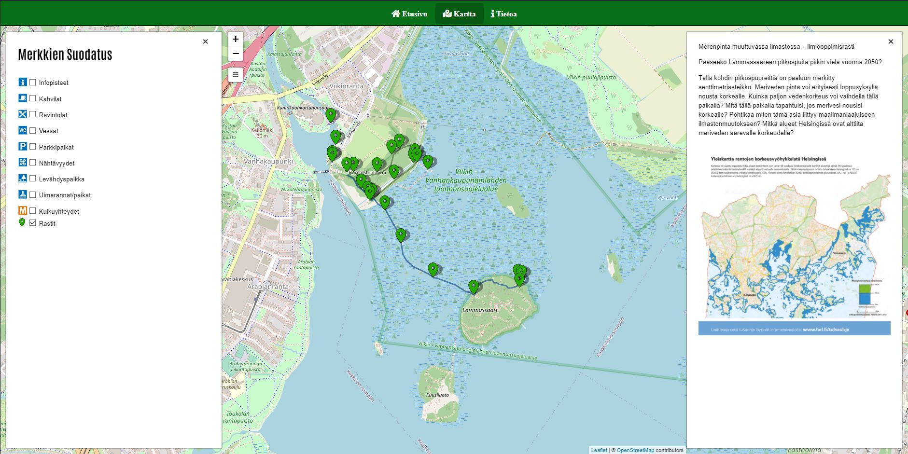

# Helsingin Luontopolut

## Luontopolut

Luontopolkujen tiedot haetaan citynature.eu REST API:sta ja asetellaan OpenSteerMap kartalle käyttäen interaktiivista leaflet karttakirjastoa. Leaflet kirjastoa on laajennettu liitäntäisillä.

### Käytetyt kirjastot:
- [Leaflet](https://leafletjs.com)
- [Leaflet.markercluster](https://github.com/Leaflet/Leaflet.markercluster)
- [Leaflet.EasyButton](https://github.com/CliffCloud/Leaflet.EasyButton)
- [leaflet-ajax](https://github.com/calvinmetcalf/leaflet-ajax)
- [leaflet-sidebar](https://github.com/Turbo87/leaflet-sidebar)

### Widgetit:
- [Weatherwidget.io](https://weatherwidget.io)

### API:
- [citynature.eu](https://citynature.eu/fi/kehittajille/)

### Kuvakaapaukset:

## Tekijät:
- Leevi Koskinen
- Peetu Salonen
- Roope Sarasoja
- Samu Wahlroos

Projekti on suoritettu osana [Metropolian](https://www.metropolia.fi) amk tutkintoa, 1.vuoden kursilla: Web-tekniikat ja digitaalinen media.

Sovelluksen kehitystyö ei enään jatku meidän osalta.

 

